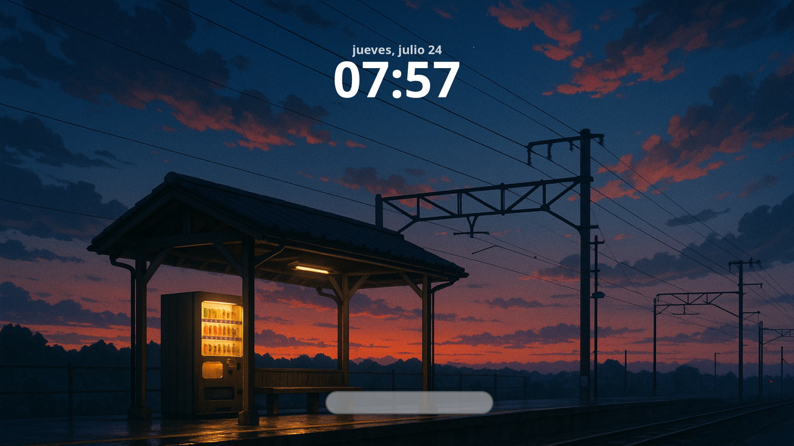
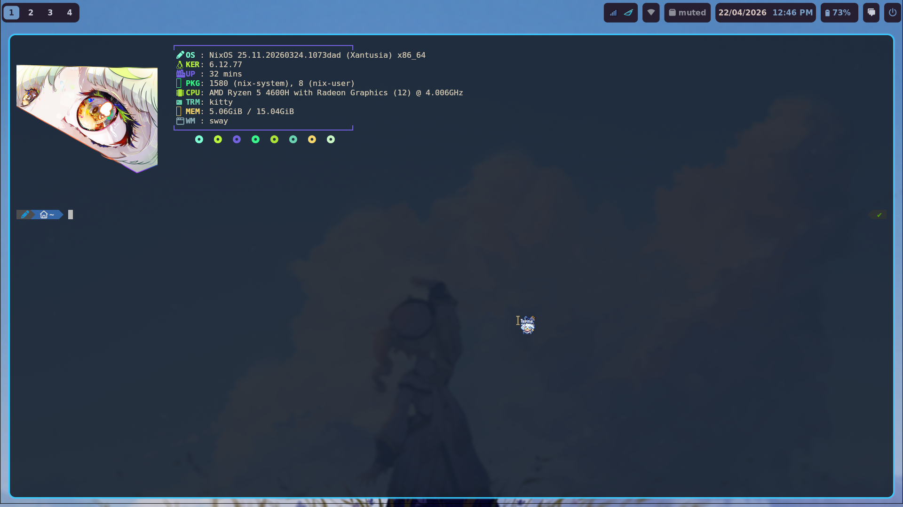
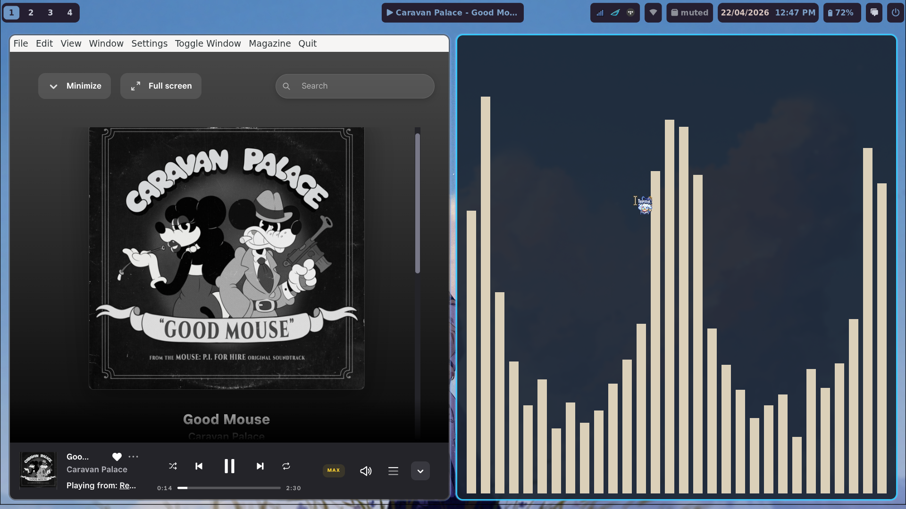
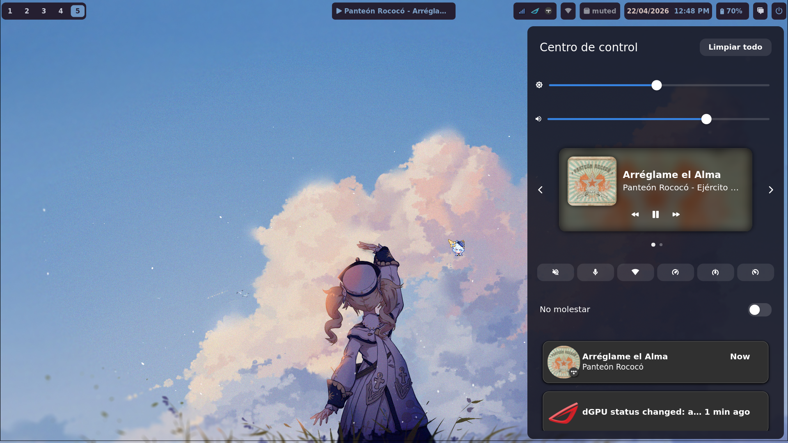
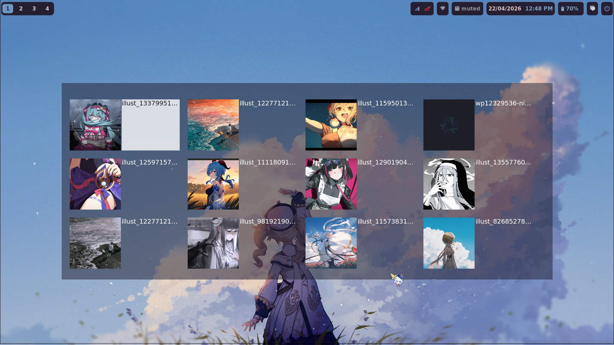
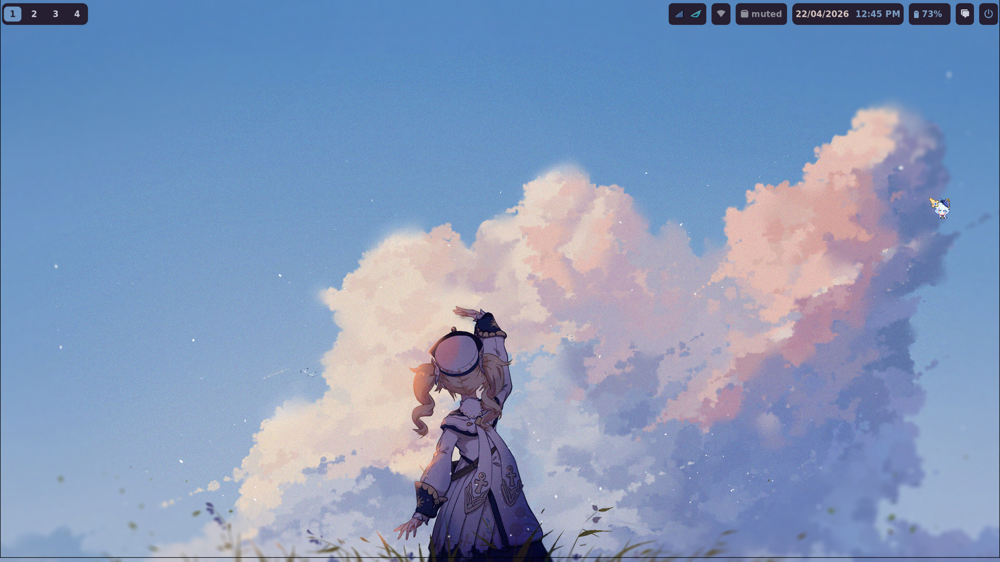
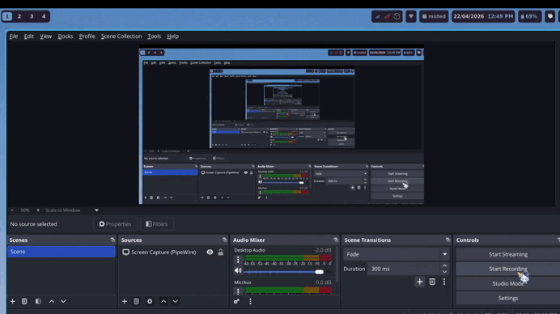

# 🌀 Hyprland Dotfiles

This is my personal **Hyprland** setup. I'm not a big fan of the excessive transparency found in many Hyprland themes, so I built my own rice with a focus on visual harmony and low eye strain.

I use Hyprland as my main operating system, so I've tuned it to be comfortable, functional, and visually balanced for daily use. If you have any suggestions or better ideas, feel free to modify or adapt this rice to your liking 😊.








---

## 📦 Main Components

- **Hyprland** – Wayland compositor
- **Waybar** – Customizable top bar
- **Hyprlock** – Lock screen
- **Hyprpaper** – Wallpaper manager
- **Swaync** – Notification center
- **Rofi / Wofi** – App launchers
- **Kitty** – Terminal emulator
- **Fish** – Friendly interactive shell
- **Fastfetch / Neofetch** – System info in terminal
- **Dolphin** – File manager

---

## 🖥️ Requirements

Before using this setup, make sure you have:

- An Arch-based distribution (recommended)
### Wayland environment
- [Hyprland](https://github.com/hyprwm/Hyprland)
- [Waybar](https://github.com/Alexays/Waybar)
- [Hyprlock](https://github.com/hyprwm/hyprlock)
- [Swww](https://github.com/LGFae/swww)
- [Swaync](https://github.com/ErikReider/SwayNotificationCenter)
- [Rofi](https://github.com/davatorium/rofi) or [Wofi](https://hg.sr.ht/~scoopta/wofi)
- [Fish](https://github.com/fish-shell/fish-shell)
- [Kitty](https://sw.kovidgoyal.net/kitty/)

### Essential Wayland utilities

* [wl-clipboard](https://github.com/bugaevc/wl-clipboard)
* [xdg-utils](https://www.freedesktop.org/wiki/Software/xdg-utils/)
* [xdg-desktop-portal-hyprland](https://github.com/hyprwm/xdg-desktop-portal-hyprland)
* [xdg-desktop-portal-gtk](https://github.com/flatpak/xdg-desktop-portal-gtk)
* [polkit-gnome](https://gitlab.gnome.org/GNOME/polkit-gnome) (or any polkit agent)

### System integration

* [network-manager-applet](https://gitlab.gnome.org/GNOME/network-manager-applet)
* [brightnessctl](https://github.com/Hummer12007/brightnessctl)
* [pavucontrol](https://freedesktop.org/software/pulseaudio/pavucontrol/)

### File manager support

* [Dolphin](https://apps.kde.org/dolphin/) or [Nemo](https://github.com/linuxmint/nemo)
* [udisks2](https://github.com/storaged-project/udisks)
* [udiskie](https://github.com/coldfix/udiskie)

### Fonts

* [Noto Fonts](https://fonts.google.com/noto)
* [Noto Emoji](https://fonts.google.com/noto/specimen/Noto+Emoji)
* [Font Awesome](https://fontawesome.com/)

### Python (for scripts)

* [Python](https://www.python.org/)
* [Pywal](https://github.com/dylanaraps/pywal)


---

## 🚀 Installation

### 1. Install dependencies

```bash id="x8o9k2"
# Core
sudo pacman -S hyprland waybar kitty fish rofi-wayland wl-clipboard \
xdg-utils xdg-desktop-portal-hyprland xdg-desktop-portal-gtk \
polkit-gnome network-manager-applet brightnessctl pavucontrol \
udisks2 udiskie noto-fonts noto-fonts-emoji ttf-font-awesome swww

# File manager (choose one)
sudo pacman -S dolphin
# or
sudo pacman -S nemo

# Extras
sudo pacman -S fastfetch python python-pywal

# AUR
yay -S swaync hyprlock
```

---

### 2. Clone this repository

```bash id="1i7v4p"
git clone https://github.com/VicMeGa/Hypr-Dotfiles
```

---

### 3. Move config files

```bash id="h9x3lt"
cd Hypr-Dotfiles/config
mv * ~/.config

cd ../Background
mkdir -p ~/Image/Fondo
mv * ~/Image/Fondo
```

---

### 4. Start Hyprland

Log in from your display manager (e.g., `sddm`, `greetd`, `ly`).

---

### 5. Enable services (optional but recommended)

```bash id="o3k2zm"
systemctl --user enable --now swaync
systemctl --user enable --now udiskie
```

---

## ⚠️ Notes

* Make sure to start `swww-daemon` (usually from your Hyprland config):

  ```bash
  swww-daemon &
  ```
* Screen sharing issues → check `xdg-desktop-portal-hyprland`
* Missing authentication dialogs → ensure a **polkit agent** is running
* Clipboard persistence → install a manager like `cliphist`

---
